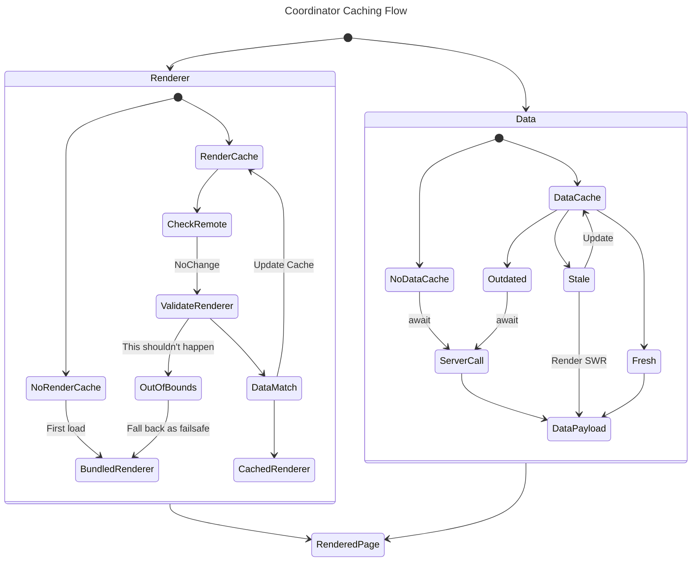

```mermaid
---
title: Coordinator Caching Flow
---
stateDiagram
  [*] --> Renderer
  [*] --> Data
  Renderer --> RenderedPage
  Data --> RenderedPage

  state Data {

      [*] --> DataCache
      [*] --> NoDataCache

      NoDataCache --> ServerCall: await
      DataCache --> Outdated
      Outdated --> ServerCall: await
      DataCache --> Stale
      DataCache --> Fresh

      ServerCall-->DataPayload
      Stale-->DataPayload: Render SWR
      Stale-->DataCache: Update
      Fresh-->DataPayload
   }

  state Renderer {
      [*] --> RenderCache
      [*] --> NoRenderCache
      NoRenderCache --> BundledRenderer: First load
      RenderCache --> CheckRemote

      CheckRemote --> ValidateRenderer: NoChange
      ValidateRenderer-->DataMatch
      ValidateRenderer-->OutOfBounds: This shouldn't happen
      OutOfBounds-->BundledRenderer: Fall back as failsafe
      DataMatch-->CachedRenderer

      DataMatch-->RenderCache: Update Cache

  }


```
