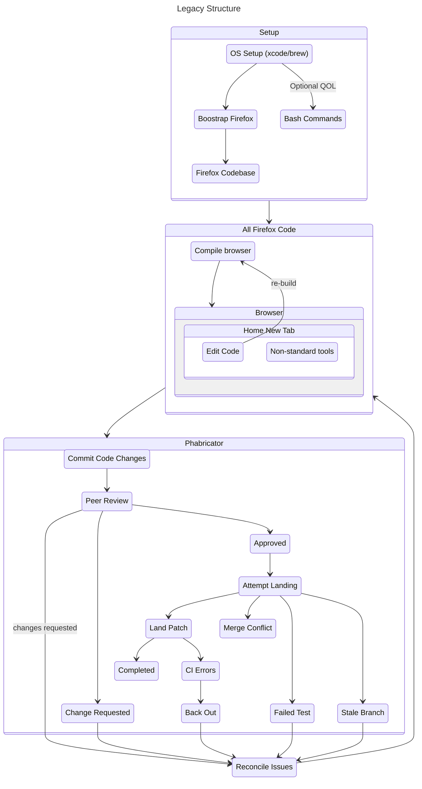
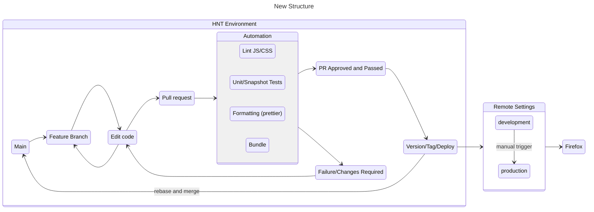

```mermaid
---
title: Legacy Structure
---
stateDiagram
Development: All Firefox Code
Setup: Setup

Setup-->Development
  Development-->Phabricator
commit-->pr
reconcile-->Development
reconcile: Reconcile Issues
pr-->reconcile: changes requested
backout-->reconcile
change-->reconcile
stale-->reconcile
failed-->reconcile


state Setup{
  ffos: OS Setup (xcode/brew)
  ffcode: Firefox Codebase
  ffbootstrap: Boostrap Firefox
  bashcommands: Bash Commands
  ffos-->ffbootstrap
  ffbootstrap-->ffcode
  ffos-->bashcommands: Optional QOL
}

state Development  {
    compile: Compile browser
    edit: Edit Code
    edit-->compile: re-build
    compile-->Browser

  state built: Browser{
    hnt: Home New Tab
    nst: Non-standard tools
    state hnt{
      edit
      nst
    }
  }
}

state Phabricator{
    commit: Commit Code Changes
    pr: Peer Review
    approved: Approved
    change: Change Requested
    attemptlanding: Attempt Landing
    landpatch: Land Patch
    completed: Completed
    cierrors: CI Errors
    backout: Back Out
    conflict: Merge Conflict
    stale: Stale Branch
    failed: Failed Test

    pr-->change
    pr-->approved
    approved-->attemptlanding
    attemptlanding-->landpatch
    attemptlanding-->conflict
    attemptlanding-->failed
    attemptlanding-->stale
    landpatch-->completed
    landpatch-->cierrors
    cierrors-->backout
  }

```

```mermaid
---
title: New Structure
---

stateDiagram
firefox: Firefox
Development: HNT Environment
main: Main
branch: Feature Branch
pr: Pull request
edit: Edit code
lint: Lint JS/CSS
test: Unit/Snapshot Tests
prettier: Formatting (prettier)
remote: Remote Settings
automation: Automation
version: Version/Tag/Deploy
failed: Failure/Changes Required
passed: PR Approved and Passed

direction LR
version-->remote
remote-->firefox

state Development{
  automation-->passed
  automation-->failed
  passed-->version
  version-->main: rebase and merge
  failed-->edit
  main-->branch
  branch-->edit
  edit-->pr

  edit-->branch
  pr-->automation
  state automation{
    direction LR
    lint
    prettier
    test
    bundle: Bundle
  }
}

state remote{
  development-->production:manual trigger
  production
}


```
