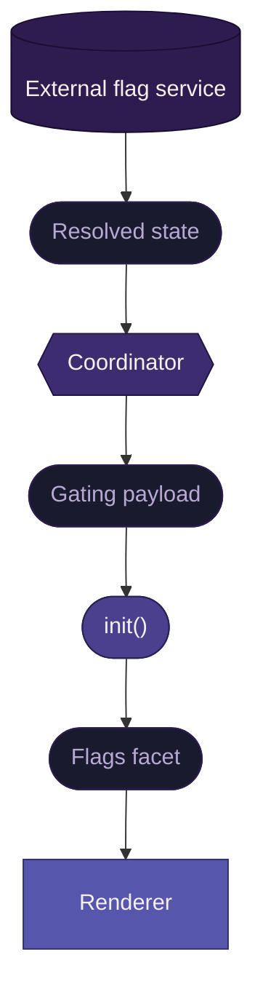

# Feature Flags <Badge type="warning" text="work in progress" />

This document defines how feature flags flow through the system, what the renderer receives, and how related concerns (rollout, market targeting, experimentation) are expressed within the flag system.

Feature flags are a **feature-level** exposure concern. The coordinator always loads the snapshot. The renderer decides what to show based on the flag context it receives.

## The external boundary

The flag system is external to this project. Flag definitions, targeting rules, cohort assignments, and rollout percentages all live in the external flag service.

This project defines:

- the shape of the flags facet in the gating payload
- the delivery path from coordinator to renderer
- how the renderer consumes flag context to make feature-level decisions

This project does not define:

- how flags are created or managed
- how targeting rules are evaluated
- how cohort assignments are made
- how rollout percentages are applied

Those are responsibilities of the external flag system. The coordinator assembles the resolved flag state and passes it through.

## Delivery flow



The coordinator retrieves the resolved flag state for the current user from the external service. It does not evaluate flags. It packages the state into the flags facet of the gating payload and passes it to the renderer through [`init()`](../spec/lifecycle-contract.md).

The renderer receives raw context and makes its own decisions. This keeps business logic in the renderer and means the coordinator does not need to change when flag logic evolves.

## Flags facet shape

::: warning Pseudo-implementation
This shape represents the delivery contract between the coordinator and renderer. The concrete format will adjust as the external flag system is integrated. What matters now is the payload delivery flow and the renderer's consumption model.
:::

The flags facet is a map of flag keys to their resolved state:

```typescript
type FlagsFacet = Record<string, FlagState>

type FlagState = {
  /** Stable identifier from the external flag system. */
  id: string

  /** Human-readable flag name. */
  name: string

  /** Whether this flag is enabled for the current user. */
  enabled: boolean

  /**
   * The variant assigned to this user, if the flag has variants.
   * Absent for simple on/off flags.
   */
  variant?: string

  /**
   * Experiment metadata, present when the flag is part of an A/B test.
   * Carries enough context for the renderer to report which variant was shown.
   */
  experiment?: {
    /** Stable identifier for the experiment. */
    id: string

    /** The key the renderer uses when reporting metrics for this experiment. */
    metricsKey: string
  }
}
```

Each flag entry carries its own identity (`id`, `name`) so it remains identifiable when extracted from the map, for logging, metrics reporting, or debugging.

Most flags are simple:

```typescript
{
  "new-feature": {
    id: "flag-1234",
    name: "New Feature",
    enabled: true
  }
}
```

A flag involved in an experiment:

```typescript
{
  "redesigned-layout": {
    id: "flag-5678",
    name: "Redesigned Layout",
    enabled: true,
    variant: "treatment-b",
    experiment: {
      id: "layout-2026-q1",
      metricsKey: "layout_experiment"
    }
  }
}
```

A flag that is off for this user (due to rollout, market, or any other reason):

```typescript
{
  "regional-feature": {
    id: "flag-9012",
    name: "Regional Feature",
    enabled: false
  }
}
```

The renderer does not know _why_ a flag is off. That distinction (market targeting, rollout percentage, manual disable) is a concern of the external flag system and the analytics layer, not the renderer.

## What lives inside the flag system

Several concerns that might appear to be independent gating facets are actually expressions of the flag system:

### Gradual rollout

The external flag service assigns users to cohorts and controls rollout percentages. The coordinator receives the resolved result. From the renderer's perspective, a flag in gradual rollout looks exactly like any other flag: `{ enabled: true }` or `{ enabled: false }`.

The rollout state (percentage, cohort assignment) does not appear in the flags facet. The renderer does not need it to make rendering decisions.

### Market targeting

Whether a feature is available in a user's market or region is expressed as a flag. The external flag service evaluates geographic targeting rules. The coordinator receives the resolved result. The renderer sees `{ enabled: true }` or `{ enabled: false }`.

::: info Market is not locale
Market targeting and locale are distinct concerns.

**Locale** answers: "can we show content in this user's language?" It is tied to the l10nHash, the translations collection, and Fluent's fallback chain. Locale is a **snapshot-level** exposure concern managed by the coordinator.

**Market** answers: "is this feature available in this user's region?" It is a business rule expressed through the flag system. Market is a **feature-level** exposure concern consumed by the renderer.

A user can be in a supported locale but an unsupported market, or vice versa. These are independent dimensions.
:::

### Experimentation (A/B)

A/B tests are flags with experiment metadata. The external flag service handles assignment stability (same user sees the same variant across sessions) and exclusion groups (conflicting experiments don't overlap).

The renderer's responsibilities:

- render the assigned variant
- report which variant was shown, using the experiment's `metricsKey`

The renderer does not manage assignments, evaluate experiment eligibility, or auto-promote winners. Those are external system concerns.

## Renderer consumption

The renderer accesses the flags facet from the gating payload received through `init()`. It makes feature-level decisions based on flag state:

- **Simple gating:** check `enabled` to show or hide a feature
- **Variant rendering:** check `variant` to select which experience to render
- **Metrics reporting:** use `experiment.metricsKey` when reporting metrics for an experiment flag

When a flag is absent from the facet, the renderer should treat it as `{ enabled: false }`. Absence means the flag is not active for this user.

The renderer composes its own flag evaluations. There are no system-level composition rules for feature flags. The renderer decides what combination of flags produces what experience. This is ordinary business logic.

## What flags do not do

Flags do not gate at the snapshot level. The coordinator always loads the snapshot regardless of flag state. A flag that is `{ enabled: false }` for every feature does not prevent the snapshot from loading. It means the renderer renders its default experience.

Snapshot-level exposure is the [locale gate's](./l10n.md) concern, not the flag system's.

<span id="open-edges"></span>

::: details Open edges

**Resolved:**

- Flags, rollout, market, and A/B are a single system, not four separate gating facets
- The gating payload has two top-level facets: `flags` and `locale`
- Flags are feature-level only. The coordinator passes through, does not evaluate.
- Market targeting is distinct from locale
- A/B is metrics-connected-to-a-flag, no auto-promotion
- The renderer does not know why a flag is off (market, rollout, etc.)

**To be refined:**

- Concrete flag shape will adjust when the external flag system is integrated
- Whether the renderer needs additional experiment metadata beyond `id` and `metricsKey` (e.g., experiment start date, reporting window)
- How the coordinator handles flag service unavailability (stale cache? empty facet? default flags?)
  :::

## Related documentation

- [Gating](./gating.md) — the overall gating model (validation and exposure gates)
- [Localization](./l10n.md) — locale as the snapshot-level exposure gate
- [Lifecycle contract](../spec/lifecycle-contract.md) — gating payload flows through `init()`
- [Metrics](../patterns/metrics.md) — how the renderer reports experiment metrics
