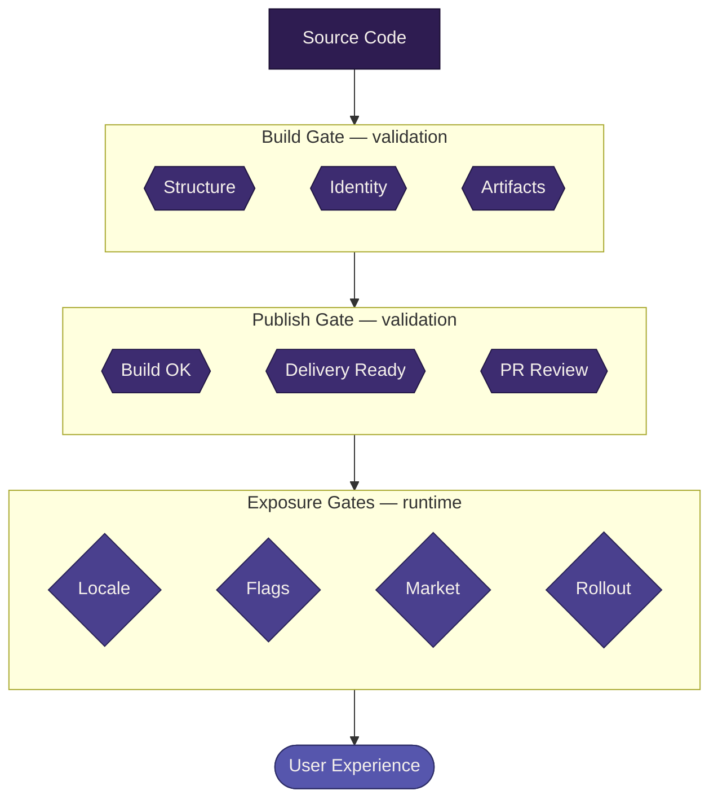

# Gating <Badge type="warning" text="work in progress" />

This document describes where the gates are in the system, what each one checks, and what trust model they create.

Gates are how the system enforces correctness and controls exposure. They exist at different stages, serve different purposes, and create different downstream guarantees.

## Two kinds of gates

The system has two fundamentally different kinds of gates:

- **Validation gates** — "is this artifact correct?"
- **Exposure gates** — "should this user see this artifact?"

These are not the same concern. A snapshot can be valid but not appropriate for a given user. Understanding this distinction is essential to reasoning about the system.

|                  | Validation gates           | Exposure gates                     |
| ---------------- | -------------------------- | ---------------------------------- |
| **When**         | Before runtime             | At runtime                         |
| **Question**     | Is this correct?           | Is this appropriate for this user? |
| **Failure mode** | Reject the artifact        | Fall back or withhold              |
| **Owner**        | Build and publish pipeline | Coordinator                        |
| **Determinism**  | Fully deterministic        | Context-dependent                  |

## Validation gates

Validation gates enforce correctness before artifacts reach runtime.

Their purpose is to push validation as early as possible so that runtime can stay simple. Each validation gate creates a trust boundary — downstream systems do not re-validate what upstream already checked.

### Build gate

The build system is the first gate.

It validates:

- structural completeness (required artifacts present — JS entry + CSS, always)
- identity derivation (deterministic, from contract-relevant inputs only)
- policy compliance (artifact roles correct, conditional artifacts present when required)

If the build gate rejects a snapshot, nothing downstream ever sees it.

This gate enables: the publish pipeline can trust that build output is valid.

### Publish gate

The publish pipeline is the second gate.

It validates:

- the build succeeded and produced expected artifacts
- the snapshot is ready for delivery

The publish gate does not re-validate at build level. It confirms the build gate did its job, then delivers via a PR to the remote-settings repository. The PR itself serves as a final human review point.

This gate enables: the coordinator can trust that published snapshots are complete and valid.

### Runtime trust (the intentional absence of a gate)

The coordinator does not validate snapshots at runtime.

This is by design, not an oversight.

Because validation gates enforce correctness before publish, the coordinator operates on a trust model:

::: info Core trust invariant
If a snapshot is published, it is safe to consume.
:::

This keeps runtime:

- simple (no validation logic)
- predictable (no conditional repair or interpretation)
- fast (no re-checking what was already verified)

If a published snapshot is somehow invalid, that represents a failure in the validation gates — not a missing runtime check.

## Exposure gates

Exposure gates control which valid snapshots reach which users.

A snapshot that passes all validation gates is correct — but correctness alone does not determine whether a specific user should see it. Exposure gates answer a different question:

> Given this user's context, should they receive this snapshot?

Exposure decisions are made at runtime by the coordinator.

### Categories of exposure gates

The system anticipates several categories of exposure concern:

#### Locale availability

Whether translations exist for the user's locale.

A snapshot is always valid and available in en-US — the baseline FTL is baked into the snapshot as a universally required artifact. For any other locale, availability depends on whether a translation exists in the translations collection for the snapshot's `l10nHash`.

Availability states for a given (snapshot, locale) pair:

| State    | Meaning                                                    | Coordinator behavior                          |
| -------- | ---------------------------------------------------------- | --------------------------------------------- |
| **Full** | Translation exists for this `l10nHash` and covers all keys | Serve snapshot with this locale's translation |
| **None** | No translation exists for this locale + `l10nHash`         | Serve snapshot with en-US fallback            |

When no translation exists, the coordinator serves the snapshot with en-US as the locale. The Fluent runtime supports fallback chains natively — en-US is always the terminal fallback.

::: warning Locale straddles both gate types
Baseline FTL presence and key completeness are **validation** concerns (build-time, structural). Translation availability for a specific locale is an **exposure** concern (runtime, contextual). The same system — localization — participates in both, but at different stages with different questions. See [Localization](./l10n.md) for the full pipeline.
:::

#### Feature flags

Whether a feature or experience variant is enabled for this user.

Feature flags control gradual rollout, experimentation, and conditional behavior. They determine whether a user is eligible for a specific experience.

#### Market targeting

Whether the snapshot is intended for the user's market or region.

Some experiences may be market-specific — available only in certain geographies or under certain conditions.

#### Gradual rollout

Whether this user falls within the rollout percentage.

Even when a snapshot is valid and the user is eligible by locale, flags, and market, the system may choose to expose it gradually to manage risk.

### Exposure gate properties

Exposure gates share some common properties that distinguish them from validation gates:

- **Context-dependent** — the answer depends on who the user is, not just what the artifact contains
- **Fallback-oriented** — failure means "show something else," not "reject"
- **Reversible** — exposure decisions can change without rebuilding artifacts
- **Composable** — multiple exposure gates may apply simultaneously (a user must pass locale + feature flag + market + rollout)

### Exposure failure mode

When an exposure gate withholds a snapshot, the system needs a fallback strategy.

The exact mechanism is not yet defined, but the principle is:

- the user should see a valid experience (not a blank page)
- the fallback should be a previously valid snapshot, not a degraded or partial state
- the coordinator decides the fallback, not the renderer

## The gate chain

Putting it together, the full gate chain looks like:

Each stage trusts the ones before it. The coordinator does not re-validate what build checked. Exposure gates do not question whether the snapshot is valid — only whether this user should see it.

## What this model protects

This gating model protects the system from:

- **invalid artifacts reaching runtime** — validation gates reject before publish
- **runtime complexity** — no validation logic in the coordinator
- **inappropriate exposure** — valid snapshots can still be withheld from users who shouldn't see them
- **conflating correctness with eligibility** — a snapshot can be valid but not ready for a given audience

::: details Open edges

**Resolved:**

- Validation gates are build and publish. Runtime does not validate.
- CSS is universally required at the build gate.

**To be defined:**

- Locale exposure rules (how translation availability affects user exposure)
- Feature flag system design
- Market targeting rules
- Gradual rollout mechanism
- Fallback strategy when exposure gates withhold a snapshot
- How exposure gates compose
  :::

## Related documentation

- [Build system (first validation gate)](./build-system.md)
- [Publish pipeline (second validation gate)](./publish-pipeline.md)
- [Coordinator (exposure gate owner at runtime)](./coordinator.md)
- [Validation rules (what the build gate enforces)](../spec/validation-rules.md)
- [Snapshot contract (what validation gates protect)](../spec/snapshot-contract.md)
- [Localization (straddles both gate types)](./l10n.md)
