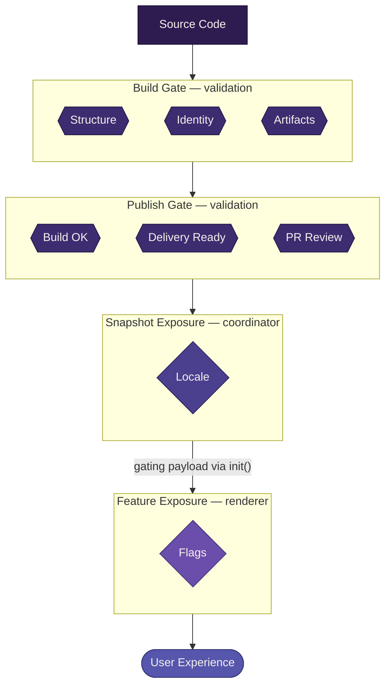

# Gating <Badge type="warning" text="work in progress" />

This document describes where the gates are in the system, what each one checks, and what trust model they create.

Gates are how the system enforces correctness and controls exposure. They exist at different stages, serve different purposes, and create different downstream guarantees.

## Two kinds of gates

The system has two fundamentally different kinds of gates:

- **Validation gates** — "is this artifact correct?"
- **Exposure gates** — "should this user see this artifact?"

These are not the same concern. A snapshot can be valid but not appropriate for a given user. Understanding this distinction is essential to reasoning about the system.

|                  | Validation gates           | Exposure gates                                    |
| ---------------- | -------------------------- | ------------------------------------------------- |
| **When**         | Before runtime             | At runtime                                        |
| **Question**     | Is this correct?           | Is this appropriate for this user?                |
| **Failure mode** | Reject the artifact        | Fall back or withhold                             |
| **Owner**        | Build and publish pipeline | Coordinator (snapshot) + Renderer (feature)       |
| **Determinism**  | Fully deterministic        | Context-dependent                                 |

## Validation gates

Validation gates enforce correctness before artifacts reach runtime.

Their purpose is to push validation as early as possible so that runtime can stay simple. Each validation gate creates a trust boundary — downstream systems do not re-validate what upstream already checked.

### Build gate

The build system is the first gate.

It validates:

- structural completeness (required artifacts present — JS entry + CSS + baseline FTL, always)
- identity derivation (deterministic, from contract-relevant inputs only)
- policy compliance (artifact roles correct, conditional artifacts present when required)

If the build gate rejects a snapshot, nothing downstream ever sees it.

This gate enables: the publish pipeline can trust that build output is valid.

### Publish gate

The publish pipeline is the second gate.

It validates:

- the build succeeded and produced expected artifacts
- the snapshot is ready for delivery

The publish gate does not re-validate at build level. It confirms the build gate did its job, then delivers via a PR to the remote-settings repository. The PR itself serves as a final human review point.

This gate enables: the coordinator can trust that published snapshots are complete and valid.

### Runtime trust (the intentional absence of a gate)

The coordinator does not validate snapshots at runtime.

This is by design, not an oversight.

Because validation gates enforce correctness before publish, the coordinator operates on a trust model:

::: info Core trust invariant
If a snapshot is published, it is safe to consume.
:::

This keeps runtime:

- simple (no validation logic)
- predictable (no conditional repair or interpretation)
- fast (no re-checking what was already verified)

If a published snapshot is somehow invalid, that represents a failure in the validation gates — not a missing runtime check.

## Exposure gates

Exposure gates control which valid snapshots reach which users.

A snapshot that passes all validation gates is correct — but correctness alone does not determine whether a specific user should see it. Exposure gates answer a different question:

> Given this user's context, should they receive this snapshot?

Exposure decisions are made at runtime — by the coordinator at the snapshot level, and by the renderer at the feature level.

### Categories of exposure gates

The system anticipates several categories of exposure concern:

#### Locale availability

Whether translations exist for the user's locale.

A snapshot is always valid and available in en-US — the baseline FTL is baked into the snapshot as a universally required artifact. For any other locale, availability depends on whether a translation exists in the translations collection for the snapshot's `l10nHash`.

Availability states for a given (snapshot, locale) pair:

| State       | Meaning                                                    | Coordinator behavior                                        |
| ----------- | ---------------------------------------------------------- | ----------------------------------------------------------- |
| **Full**    | Translation exists for this `l10nHash` and covers all keys | Serve snapshot with this locale's translation                |
| **Partial** | Translation exists but does not yet cover all keys (expected during carry-forward) | Serve snapshot with translation; Fluent falls back to en-US per missing key |
| **None**    | No translation exists for this locale + `l10nHash`         | Serve snapshot with en-US fallback                           |

Partial translations are expected during the [carry-forward window](./l10n.md#carry-forward) after a key-set change. Fluent handles per-key fallback natively — en-US is always the terminal fallback. The renderer receives availability state and completeness metadata in the gating payload's locale facet for feature-level decisions.

::: warning Locale straddles both gate types
Baseline FTL presence and key completeness are **validation** concerns (build-time, structural). Translation availability for a specific locale is an **exposure** concern (runtime, contextual). The same system — localization — participates in both, but at different stages with different questions. See [Localization](./l10n.md) for the full pipeline.
:::

#### Feature flags

Whether a feature or experience variant is enabled for this user.

Feature flags are a **feature-level** exposure concern, not a snapshot-level one. The coordinator always loads the snapshot. The renderer decides what to show based on the flag context it receives through the gating payload.

The flag system encompasses several related concerns that are all expressed as flags:

- **Gradual rollout** — whether this user falls within a rollout percentage
- **Market targeting** — whether a feature is available in this user's region (distinct from locale, which is about content availability)
- **Experimentation** — A/B test variant assignments with metrics metadata

These are resolved by an external flag service. The coordinator assembles the resolved state and passes it through. The renderer does not know why a flag is on or off. It only knows the current state.

For the full flag system design, see [Feature flags](./feature-flags.md).

### Exposure gate properties

Exposure gates share some common properties that distinguish them from validation gates:

- **Context-dependent** — the answer depends on who the user is, not just what the artifact contains
- **Fallback-oriented** — failure means "show something else," not "reject"
- **Reversible** — exposure decisions can change without rebuilding artifacts
- **Composable** — exposure gates operate at two levels (snapshot and feature) with clear ownership at each level

### Snapshot-level fallback

The only snapshot-level exposure gate is locale availability. When the coordinator cannot provide translations for the user's locale, it falls back to en-US. The baseline FTL is always present in the snapshot, so en-US is always available.

This means the snapshot always loads. There is no scenario where the coordinator withholds a snapshot entirely based on exposure. Locale determines which translation the snapshot receives, not whether it loads.

### Feature-level degradation

Feature-level exposure is the renderer's concern. When the renderer withholds a feature based on flag context, it handles degradation internally. A flag that says "don't show feature X" means the renderer doesn't render it. This is ordinary business logic, not a system-level fallback.

### Two-level exposure model

::: info Not yet in code
The two-level exposure model and gating payload are defined here but not yet implemented. The current coordinator does not pass a gating payload through `init()`.
:::

Exposure gates operate at two levels.

**Snapshot-level exposure** is the coordinator's decision. The coordinator determines which translation to serve based on locale availability (Full, Partial, or None for the user's locale). The snapshot always loads. Locale determines the translation context, not whether the snapshot is served.

**Feature-level exposure** is the renderer's decision. Once loaded, the renderer makes finer-grained exposure decisions based on the flags facet — showing or hiding features, selecting experience variants, adapting content based on flag state.

The coordinator cannot make feature-level decisions because it does not know the renderer's internal structure. The renderer cannot make snapshot-level decisions because it does not control its own loading. Each level has the right owner.

#### The gating payload

The bridge between these two levels is the **gating payload** — a single structured object the coordinator passes to the renderer through [`init()`](../spec/lifecycle-contract.md).

The gating payload carries raw context, not pre-evaluated results. The renderer receives the inputs and makes its own decisions. This aligns with the system's core principle: business logic lives in the renderer.

The payload is a single object with two facets:

- **locale** — locale, fallback chain, availability state (Full/Partial/None), and completeness
- **flags** — resolved feature flag state, including rollout, market targeting, and experiment metadata

One object at the coordinator/renderer seam. Locale provides the snapshot-level translation context. Flags provide the feature-level exposure context the renderer uses to make rendering decisions. See [Feature flags](./feature-flags.md) for the full flags facet design.

#### Why raw context, not evaluated results

The coordinator could evaluate flags and pass booleans. But that would move business logic into the coordinator — exactly what the system's architecture avoids.

By passing raw context:

- the renderer owns its own exposure decisions
- the coordinator prepares context without interpreting it
- feature-level logic can change without coordinator changes
- the same renderer can interpret context differently across versions

The coordinator provides context. The renderer decides what to show.

## The gate chain

Putting it together, the full gate chain looks like:

Each stage trusts the ones before it. The coordinator does not re-validate what build checked. Snapshot-level exposure determines translation context for the user's locale. Feature-level exposure uses the flags facet to make rendering decisions within the loaded snapshot.

## What this model protects

This gating model protects the system from:

- **invalid artifacts reaching runtime** — validation gates reject before publish
- **runtime complexity** — no validation logic in the coordinator
- **inappropriate exposure** — the renderer controls which features are shown based on flag context
- **conflating correctness with eligibility** — a snapshot is always valid and always loads, but what it shows depends on user context

::: details Open edges

**Resolved:**

- Validation gates are build and publish. Runtime does not validate.
- CSS is universally required at the build gate.
- Two-level exposure model: coordinator gates at snapshot level (locale), renderer gates at feature level (flags).
- Gating payload: two facets — `locale` and `flags` — passed through `init()`.
- Locale exposure: Full/Partial/None availability states defined. Locale is the only snapshot-level exposure gate.
- Flags, rollout, market, and A/B consolidated into a single flag system. See [Feature flags](./feature-flags.md).
- Snapshot-level fallback: locale-only. en-US always available via baseline FTL. Snapshot always loads.
- Flags are feature-level only. The coordinator passes through, does not evaluate.
- Gate composition: snapshot level is locale only, no multi-gate composition needed. Feature-level composition is renderer business logic.

**To be refined:**

- Concrete flag shape will adjust when the external flag system is integrated (see [Feature flags open edges](./feature-flags.md#open-edges))
- How the coordinator handles flag service unavailability
:::

## Related documentation

- [Feature flags](./feature-flags.md) — the flags facet design (rollout, market, A/B)
- [Build system](./build-system.md) — first validation gate
- [Publish pipeline](./publish-pipeline.md) — second validation gate
- [Coordinator](./coordinator.md) — snapshot-level exposure gate owner
- [Renderer](./renderer.md) — feature-level exposure gate owner
- [Lifecycle contract](../spec/lifecycle-contract.md) — gating payload flows through init()
- [Validation rules](../spec/validation-rules.md) — what the build gate enforces
- [Snapshot contract](../spec/snapshot-contract.md) — what validation gates protect
- [Localization](./l10n.md) — straddles both gate types
