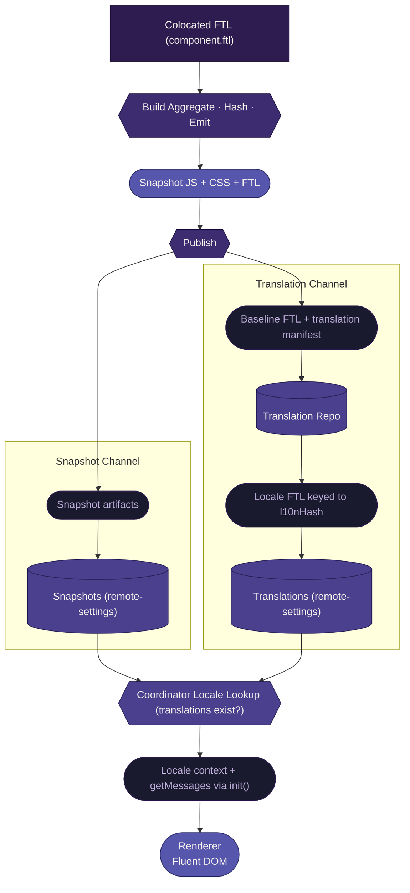

# Localization <Badge type="warning" text="work in progress" />

This document defines how localization works end-to-end in the renderer snapshot pipeline.

It covers:

- how localizable content is authored
- how it flows through the build system
- how it participates in snapshot identity and validation
- how translations are produced and delivered separately
- how the coordinator uses locale availability as an exposure gate

## End-to-end flow



## Authoring model

Localizable content is authored in Fluent (`.ftl`) files, colocated with their component source.

```
ui/components/todo/component.ftl
ui/components/weather/component.ftl
```

All FTL in this repository is **en-US baseline**. No other locale is authored here. Non-baseline translations are produced externally through the translation pipeline.

Components reference message IDs via `data-l10n-id` attributes. The ESLint plugin (`no-missing-message`) validates at edit time that every `data-l10n-id` resolves to a key in the colocated FTL.

## Build pipeline

::: info Not yet in code
The Vite plugin currently provides FTL via virtual modules for development. The production emit step (writing baseline FTL as a snapshot artifact with key-set hashing) is not yet wired into the renderer build.
:::

The build system aggregates colocated FTL files into a single baseline artifact for the snapshot. The individual component files are preserved for the translation handoff.

Steps:

1. **Scan** — glob for all `component.ftl` files across the renderer's component tree
2. **Sort** — order files deterministically (alphabetical by path)
3. **Concatenate** — combine into a single en-US FTL source
4. **Extract keys** — collect all message IDs from the concatenated source
5. **Hash** — derive `l10nHash` from the sorted key set (not full content — see [why key-set hashing](#why-key-set-hashing) below)
6. **Emit** — write the baseline FTL as a snapshot artifact

Build output:

```
dist/
  entry.<js-hash>.js                   — execution artifact
  styles.<css-hash>.css                — presentation artifact
  locales/<l10n-hash>/en-US.ftl        — content artifact (baseline)
  manifest.json                        — declares all artifacts
```

The manifest includes localization metadata:

- `l10nDir` — path to the locale directory (e.g. `locales/a1b2c3d4`)
- `l10nHash` — hash of the baseline FTL key set

The `l10nHash` is deterministic. Given identical message IDs, it always resolves to the same value — regardless of changes to English source text.

### Why key-set hashing

`l10nHash` is derived from the sorted set of message IDs, not the full FTL content. This keeps the hash stable across non-translation-inducing changes:

| Change                            | Key set changes? | l10nHash changes? | Translation impact                 |
| --------------------------------- | ---------------- | ----------------- | ---------------------------------- |
| New feature with new strings      | Yes              | Yes               | New translation target             |
| Improvement with no new strings   | No               | No                | In-flight translations unaffected  |
| English text edit on existing key | No               | No                | Existing translations remain valid |
| Key removed                       | Yes              | Yes               | New translation target             |

This stability is critical for the [carry-forward model](#carry-forward). When l10nHash stays the same, translations accumulate additively against a stable target. When it changes, the translation pipeline carries forward existing translations and only queues new keys.

## Artifact model

Baseline FTL is a **universally required** content artifact, alongside JS (execution) and CSS (presentation):

| Category     | Artifact             | Required |
| ------------ | -------------------- | -------- |
| Execution    | JavaScript entry     | Always   |
| Presentation | CSS                  | Always   |
| Content      | Baseline FTL (en-US) | Always   |

For the full artifact composition rules, see [Artifact model](../spec/artifact-model.md).

Baseline FTL is part of the snapshot because it is authored in this repository, colocated with components, and built alongside them. It defines what the renderer says and what translation keys exist.

Non-baseline translations are **not** part of the snapshot. They are produced externally and delivered through a separate channel.

## Identity participation

Baseline FTL is **identity-bearing**. Non-baseline translations are **not**. Baseline FTL key-set changes affect what the renderer can say — if identity didn't account for that, the coordinator could reuse a stale cached snapshot. Translations, produced asynchronously out of band, change what is available for a locale's users without changing the snapshot itself.

For the full identity derivation model, see [Identity model](../spec/identity-model.md).

### `l10nHash` as a sub-identity

`l10nHash` serves a dual purpose:

1. It feeds into the snapshot-level identity (alongside JS and CSS hashes)
2. It independently identifies the key set that translations are produced against

This means translations are keyed to `l10nHash`, not `snapshotHash`. When only JS or CSS changes (no key-set change), `l10nHash` stays the same and existing translations remain valid across the new snapshot. English text changes to existing keys also preserve the hash — only key additions or removals produce a new `l10nHash`.

When the key set changes, `l10nHash` changes and the [carry-forward model](#carry-forward) activates.

## Validation (build gate)

Localization validation happens at the build gate alongside other artifact validation. For the full validation framework, see [Validation rules](../spec/validation-rules.md).

The l10n-specific rules:

- **Structural** — baseline FTL must be present. A snapshot missing it is rejected.
- **Policy** — all `data-l10n-id` references must resolve to baseline FTL keys, enforced via the ESLint `no-missing-message` rule at edit time and in CI as a hard gate.
- **Identity** — `l10nHash` must feed into the snapshot identity derivation.

## Translation pipeline

::: info Not yet in code
The translation handoff, carry-forward model, and per-component delivery are defined here but not yet implemented. No publish pipeline step currently extracts baseline FTL or pushes to a translation repository.
:::

Translations are produced outside this repository and delivered through a separate channel. We own two boundaries:

1. **Outbound** — the handoff manifest we push to the translation repository
2. **Inbound** — the translation record shape we expect from remote settings

We do not own what happens between them.

### Handoff (outbound)

When a snapshot reaches the publish pipeline (GitHub Actions), the individual `component.ftl` files are sent to the translation repository alongside a translation manifest:

::: warning Pseudo-implementation
This manifest shape represents what we commit to providing at the handoff boundary. The concrete format will adjust based on external system requirements.
:::

```typescript
type TranslationManifest = {
  /** Snapshot identity this manifest was produced from. */
  snapshotHash: string

  /** Key-set hash. Translations are keyed to this, not snapshotHash. */
  l10nHash: string

  /** Baseline locale. Always "en-US". */
  baselineLocale: "en-US"

  /** Total number of translatable keys. */
  keyCount: number

  /** Sorted list of all message IDs in the baseline. */
  keys: string[]

  /** Per-component file manifest for granular tracking. */
  components: Array<{
    /** Component path relative to the renderer root. */
    path: string

    /** Message IDs contributed by this component. */
    keys: string[]
  }>
}
```

The handoff includes per-component files (not the aggregated baseline) to enable granular translation tracking. The translation pipeline can identify which components changed and target translation work accordingly.

### Translation (external)

The translation repository receives the component files and manifest. Translators produce locale-specific translations. The translation pipeline aggregates per-component translations into per-locale FTL files before publishing to the translations collection, keyed to the aggregate `l10nHash`.

This workflow is owned outside this repository.

### Carry-forward

When `l10nHash` changes (keys added or removed), the translation pipeline carries forward existing translations:

1. Diff key sets between old and new `l10nHash`
2. Immediately publish carried-forward translations against the new hash (existing translations for unchanged keys)
3. Queue new keys for translation
4. Update the translation record as translations complete

This means a new `l10nHash` can have near-complete translations within minutes of appearing. The window of reduced completeness is proportional to the number of new keys, not the total key count.

Carry-forward is the translation pipeline's responsibility — triggered by our publish pipeline signaling the translation repo with the new baseline and manifest. Our job is to provide clean per-component files and a manifest with the key set so the pipeline can diff efficiently.

### Translation records (inbound)

::: warning Pseudo-implementation
This record shape represents what the coordinator expects to find in remote settings. The concrete format will adjust based on remote-settings capabilities and external system requirements.
:::

Translations are published to a **separate remote-settings collection** — not the same collection as the snapshot itself. The coordinator reads translation records to assemble the availability gate.

Each record represents a single (l10nHash, locale) pair:

```typescript
type TranslationRecord = {
  /** Key-set hash this translation was produced against. */
  l10nHash: string

  /** Locale code (e.g., "fr", "de", "ja"). */
  locale: string

  /** Number of keys translated out of the total key set. */
  translatedKeyCount: number

  /** Total keys in the key set (matches the handoff manifest's keyCount). */
  totalKeyCount: number

  /** Reference to the FTL resource (attachment or URL). */
  resource: string
}
```

The coordinator uses `translatedKeyCount` and `totalKeyCount` to derive availability state and completeness:

- `translatedKeyCount === totalKeyCount` → Full
- `translatedKeyCount < totalKeyCount` → Partial (completeness = `translatedKeyCount / totalKeyCount`)
- No record for this (l10nHash, locale) → None

## Two-channel delivery

The system uses two independent delivery channels:

| Channel      | Contents                             | Destination                               | Timing                           |
| ------------ | ------------------------------------ | ----------------------------------------- | -------------------------------- |
| Snapshot     | JS + CSS + baseline FTL + manifest   | remote-settings (snapshot collection)     | Ships on merge                   |
| Translations | Locale FTL files keyed to `l10nHash` | remote-settings (translations collection) | Ships when translations complete |

These channels are independent. A snapshot ships immediately with its baseline. Translations follow asynchronously as they are completed.

This separation is important because:

- Snapshots are not blocked by translation completion
- Translation updates do not require a new snapshot
- Each channel can be validated and delivered on its own schedule

## Exposure gate (runtime)

Translation availability is an **exposure gate** — a runtime decision made by the coordinator. It addresses a different question than renderer validity.

### Three delivery concerns

Locale availability spans three distinct concerns that use similar language but operate at different stages:

**Renderer delivery (build-time).** The baseline FTL must contain all keys the renderer references. This is a validation gate enforced at build. If the baseline is missing keys, the build fails. By the time the coordinator loads a snapshot, key validity is already guaranteed. This is a Full/None concern: the renderer is either valid or rejected.

**Translation delivery (runtime).** For a given locale, translations may fully cover the key set or only partially cover it. The coordinator does a simple lookup by `l10nHash` + locale. If translations exist, they are served. If none exist, en-US is served. This is a Full/Partial concern: translations are either complete or incomplete. Partial translations are expected during the carry-forward window and are usable, not an error state. Fluent handles per-key fallback natively.

**Availability metadata (runtime, passed to renderer).** The coordinator passes availability state and completeness to the renderer through the gating payload's locale facet. The renderer uses this for feature-level decisions, such as threshold logic for whether to show localized content for a feature or fall back entirely.

### Coordinator behavior

The coordinator's decision is binary: do translations exist for this locale and `l10nHash`, or don't they?

| Translations exist? | Coordinator action                            | Availability state                                                        |
| ------------------- | --------------------------------------------- | ------------------------------------------------------------------------- |
| **Yes**             | Serve snapshot with this locale's translation | Full (all keys) or Partial (some keys, Fluent falls back per missing key) |
| **No**              | Serve snapshot with en-US fallback            | None                                                                      |

en-US is always available by definition. The baseline FTL is baked into the snapshot.

The Full vs Partial distinction does not change the coordinator's action. In both cases, translations are served and Fluent resolves any missing keys from the en-US fallback chain. The distinction is metadata: the renderer receives availability state and completeness so it can make feature-level exposure decisions.

For the full exposure gate model, see [Gating](./gating.md). See [Runtime integration](#runtime-integration) below for how locale context flows to the renderer.

## Runtime integration

The host provides localization inputs to the renderer through the [`init()`](../spec/lifecycle-contract.md) lifecycle method. These inputs serve two purposes: gating context and runtime capability.

### Gating context (locale facet)

Locale context is part of the [gating payload's](./gating.md#the-gating-payload) locale facet:

- `locale` — the user's primary locale (e.g., `"fr"`)
- `fallbackLocales` — the fallback chain (e.g., `["en-US"]`)
- `availability` — Full, Partial, or None for this locale + l10nHash
- `completeness` — fraction of keys translated (e.g., `0.95`)

The renderer uses this context for feature-level exposure decisions (e.g., threshold logic for partial translations) and for initializing the Fluent runtime.

### Message loading (capability)

The host also provides a message loading function:

- `getMessages` — loads FTL source for a given locale

This is a host-provided capability, not gating context. It is the plumbing that connects the renderer to translations without coupling it to the delivery mechanism.

The `getMessages` function is host-implemented:

- For en-US: reads from the baseline FTL baked into the snapshot (always available, no network)
- For other locales: fetches from the translations remote-settings collection

### How they come together

The renderer calls `initFluentDom()` from `@common/l10n` with both inputs — locale context from the gating payload and the host-provided `getMessages` function. The Fluent runtime handles locale resolution, bundle caching, and DOM translation.

The renderer does not know where translations come from. It only knows its locale context and how to ask for messages. This keeps the renderer decoupled from the delivery mechanism.

## FluentDom and React

FluentDom and React operate alongside each other but follow fundamentally different rendering models. This is important to understand because it affects where instant paint is achievable and where latency is unavoidable.

### Two rendering models in one tree

React owns the component tree. It renders declaratively, producing DOM nodes with `data-l10n-id` attributes as content markers.

FluentDom operates on the rendered DOM. It uses a `MutationObserver` to watch for `data-l10n-id` elements, then translates their text content by mutating the DOM directly. It does not participate in React's virtual DOM reconciliation or batched update cycle.

This means rendering happens in two phases:

1. **React renders** — produces DOM structure with `data-l10n-id` markers
2. **FluentDom translates** — observes mutations, resolves message IDs, writes localized content into the DOM

These phases are sequential, not atomic. React and FluentDom do not share a rendering pipeline.

### Where instant paint is achievable

**Initial render (any locale).** `initFluentDom()` is async and gates on the first `translateRoots()` call. The renderer does not return from `init()` until translations are applied. This prevents a flash of untranslated content on first paint.

**Re-renders with a cached locale.** FluentDom caches `FluentBundle` instances per locale in memory. When React re-renders (SWR update, state change), the MutationObserver fires and FluentDom re-translates from cache — no network, no async. This is fast, but not synchronous with React's paint. There is a frame-level gap between React's DOM write and FluentDom's translation pass.

**en-US always.** The baseline FTL is baked into the snapshot. `getMessages("en-US")` never requires a network fetch. For en-US users, both initial and subsequent renders avoid network-bound latency entirely.

### Where latency is unavoidable

**First render for a non-en-US locale.** `getMessages()` returns a `Promise<string>`. For non-baseline locales, this is a network fetch to the translations collection. The `init()` gate means the renderer waits for this fetch before painting — no flash, but a slower time-to-first-paint compared to en-US.

**Locale switching.** `setLocales()` disconnects all roots, recreates the `DOMLocalization` instance, and re-translates. If the new locale's bundle is not cached, this triggers a `getMessages()` fetch. The UI is translated but momentarily stale during the switch.

**The SWR frame gap.** On SWR-driven re-renders, React writes new DOM and FluentDom re-translates from cache. The cache makes this fast, but the two-phase model means there is always at least one frame where React has painted structure but FluentDom has not yet translated it. For most updates this is imperceptible, but it is architecturally present and worth acknowledging.

### Why FluentDom and not a React-native approach

FTL and Fluent are organizational standards — this is not a choice to revisit. FluentDom's MutationObserver model is battle-tested and decouples localization from the component tree.

A React-native approach (hooks, context, synchronous string resolution) would eliminate the two-phase gap but would deeply couple every component to the localization system. FluentDom keeps localization as a DOM-level concern that components opt into via `data-l10n-id` attributes, without importing localization APIs.

There is also a pragmatic consideration: if the rendering layer changes in the future, FluentDom's DOM-level approach survives that change. React is more likely to be re-examined than FTL. Keeping localization decoupled from the component framework means one can change without forcing changes in the other.

The trade-off is explicit: FluentDom gives us decoupling, organizational alignment, and framework flexibility at the cost of the frame-level gap on re-renders. The `init()` gate and bundle caching minimize the practical impact.

## Local development vs production

| Concern              | Local dev                                                         | Production                                 |
| -------------------- | ----------------------------------------------------------------- | ------------------------------------------ |
| FTL authoring        | Colocated `component.ftl` in repo                                 | Same source                                |
| FTL bundling         | Vite plugin (virtual module)                                      | Vite plugin (emitted file)                 |
| Runtime loading      | Virtual module content (Storybook) or dev server fetch (renderer) | `getMessages` fetches from remote-settings |
| Available locales    | en-US only (unless manually added)                                | en-US + all completed translations         |
| Locale switching     | Supported via `setLocales()` for testing                          | Full locale switching via coordinator      |
| Validation           | ESLint in editor + CI                                             | Same ESLint + build gate                   |
| Translation pipeline | Does not exist locally                                            | GitHub Actions workflow                    |

In local development:

- The Vite plugin provides FTL content via virtual modules for Storybook
- The renderer dev server can serve the concatenated FTL at a known path for the `getMessages` function
- Only en-US is available unless developers manually add locale files for testing
- The ESLint plugin provides the same key validation as CI

## Existing infrastructure

The following packages already exist and should be reused:

### `@common/l10n` (runtime)

- `initFluentDom()` — initializes Fluent DOM with locale, fallback chain, roots, and message loader
- Returns `FluentDomRuntime` with `translate()`, `setLocales()`, `clearCache()`
- Handles locale switching, bundle caching, and fallback resolution

### `@config/l10n-config` (build tooling)

- **Vite plugin (`fluentL10n`)** — scans colocated FTL, concatenates into virtual modules, supports HMR
- **Fluent utilities** — FTL parsing, caching, message ID lookup with Levenshtein suggestions
- **ESLint plugin (`no-missing-message`)** — validates `data-l10n-id` attributes against colocated FTL

### Storybook integration

- `withL10n` decorator wires virtual Fluent bundle through `initFluentDom`
- HMR support via custom `fluent:bundle-updated` event

## What this document does not cover

- What happens between handoff and delivery (the translation workflow itself)
- Feature flags (feature-level exposure, see [Feature flags](./feature-flags.md))
- The `init()` lifecycle method implementation (defined in the lifecycle contract)

## Related documentation

- [Artifact model](../spec/artifact-model.md) — how snapshots are composed
- [Identity model](../spec/identity-model.md) — how snapshot identity is derived
- [Validation rules](../spec/validation-rules.md) — how contract compliance is enforced
- [Gating](./gating.md) — validation vs exposure gates
- [Build system](./build-system.md) — how artifacts are produced
- [Publish pipeline](./publish-pipeline.md) — how artifacts are delivered
- [Renderer](./renderer.md) — how the user experience is built
- [Lifecycle contract](../spec/lifecycle-contract.md) — renderer lifecycle and host responsibilities
