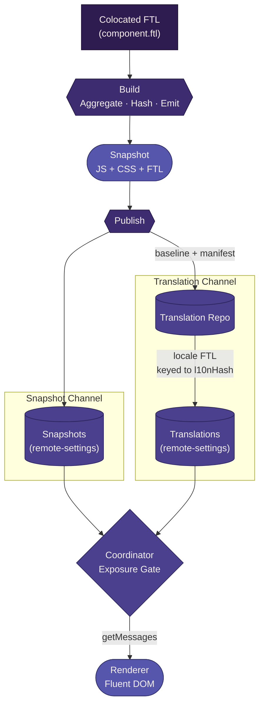

# Localization <Badge type="warning" text="work in progress" />

This document defines how localization works end-to-end in the renderer snapshot pipeline.

It covers:

- how localizable content is authored
- how it flows through the build system
- how it participates in snapshot identity and validation
- how translations are produced and delivered separately
- how the coordinator uses locale availability as an exposure gate

## End-to-end flow



## Authoring model

Localizable content is authored in Fluent (`.ftl`) files, colocated with their component source.

```
ui/components/todo/component.ftl
ui/components/weather/component.ftl
```

All FTL in this repository is **en-US baseline**. No other locale is authored here. Non-baseline translations are produced externally through the translation pipeline.

Components reference message IDs via `data-l10n-id` attributes. The ESLint plugin (`no-missing-message`) validates at edit time that every `data-l10n-id` resolves to a key in the colocated FTL.

## Build pipeline

The build system aggregates colocated FTL files into a single baseline artifact.

Steps:

1. **Scan** — glob for all `component.ftl` files across the renderer's component tree
2. **Sort** — order files deterministically (alphabetical by path)
3. **Concatenate** — combine into a single en-US FTL source
4. **Hash** — derive a content hash from the concatenated output
5. **Emit** — write the baseline FTL as a snapshot artifact

Build output:

```
dist/
  index.<js-hash>.js                   — execution artifact
  assets/renderer.<css-hash>.css       — presentation artifact
  locales/<l10n-hash>/en-US.ftl        — content artifact (baseline)
  manifest.json                        — declares all artifacts
```

The manifest includes localization metadata:

- `l10nDir` — path to the locale directory (e.g. `locales/a1b2c3d4`)
- `l10nHash` — content hash of the baseline FTL
- `l10nKeyCount` — total message IDs in the baseline

The `l10nHash` is deterministic. Given identical FTL source files, it always resolves to the same value.

## Artifact model

Baseline FTL is a **universally required** content artifact, alongside JS (execution) and CSS (presentation):

| Category | Artifact | Required |
|----------|----------|----------|
| Execution | JavaScript entry | Always |
| Presentation | CSS | Always |
| Content | Baseline FTL (en-US) | Always |

For the full artifact composition rules, see [Artifact model](../spec/artifact-model.md).

Baseline FTL is part of the snapshot because it is authored in this repository, colocated with components, and built alongside them. It defines what the renderer says and what translation keys exist.

Non-baseline translations are **not** part of the snapshot. They are produced externally and delivered through a separate channel.

## Identity participation

Baseline FTL is **identity-bearing**. Non-baseline translations are **not**. Baseline FTL changes affect what the renderer says — if identity didn't account for that, the coordinator could reuse a stale cached snapshot. Translations, produced asynchronously out of band, change what is available for a locale's users without changing the snapshot itself.

For the full identity derivation model, see [Identity model](../spec/identity-model.md).

### `l10nHash` as a sub-identity

`l10nHash` serves a dual purpose:

1. It feeds into the snapshot-level identity (alongside JS and CSS hashes)
2. It independently identifies the key set that translations are produced against

This means translations are keyed to `l10nHash`, not `snapshotHash`. When only JS or CSS changes (no FTL content change), `l10nHash` stays the same and existing translations remain valid across the new snapshot.

When FTL content changes, `l10nHash` changes, and new translations are needed.

## Validation (build gate)

Localization validation happens at the build gate alongside other artifact validation. For the full validation framework, see [Validation rules](../spec/validation-rules.md).

The l10n-specific rules:

- **Structural** — baseline FTL must be present. A snapshot missing it is rejected.
- **Policy** — all `data-l10n-id` references must resolve to baseline FTL keys, enforced via the ESLint `no-missing-message` rule at edit time and in CI as a hard gate.
- **Identity** — `l10nHash` must feed into the snapshot identity derivation.

## Translation pipeline

Translations are produced outside this repository and delivered through a separate channel.

### Extraction

When a snapshot reaches the publish pipeline (GitHub Actions), the baseline FTL artifact is extracted along with a translation manifest:

```json
{
  "snapshotHash": "<snapshot-identity>",
  "l10nHash": "<baseline-content-hash>",
  "baselineLocale": "en-US",
  "keyCount": 35,
  "keys": ["lists-silly-title", "lists-name-label-default", "..."]
}
```

This manifest describes what needs translation for this snapshot version.

### Translation

The translation manifest and baseline FTL are delivered to the translation repository. Translators produce locale-specific FTL files (e.g., `fr.ftl`, `de.ftl`, `ja.ftl`). Each translated file is validated against the key set from the manifest.

### Delivery

Completed translations are published to a **separate remote-settings collection** — not the same collection as the snapshot itself. Translation records reference the `l10nHash` they were translated against.

```
translations-collection/
  <l10nHash>/
    fr.ftl
    de.ftl
    ja.ftl
```

## Two-channel delivery

The system uses two independent delivery channels:

| Channel | Contents | Destination | Timing |
|---------|----------|-------------|--------|
| Snapshot | JS + CSS + baseline FTL + manifest | remote-settings (snapshot collection) | Ships on merge |
| Translations | Locale FTL files keyed to `l10nHash` | remote-settings (translations collection) | Ships when translations complete |

These channels are independent. A snapshot ships immediately with its baseline. Translations follow asynchronously as they are completed.

This separation is important because:

- Snapshots are not blocked by translation completion
- Translation updates do not require a new snapshot
- Each channel can be validated and delivered on its own schedule

## Exposure gate (runtime)

Translation availability is an **exposure gate** — a runtime decision made by the coordinator.

A valid snapshot is always available in en-US (the baseline is baked in). For any other locale, availability depends on whether a translation exists in the translations collection for the snapshot's `l10nHash`.

### Availability states

For a given (snapshot, locale) pair:

| State | Meaning | Coordinator behavior |
|-------|---------|---------------------|
| **Full** | Translation exists for this `l10nHash` and covers all keys | Serve snapshot with this locale's translation |
| **None** | No translation exists for this locale + `l10nHash` | Serve snapshot with en-US fallback |

en-US is always Full by definition — the baseline is in the snapshot.

When no translation exists, the coordinator falls back to en-US. For the full exposure gate model and fallback behavior, see [Gating](./gating.md).

## Runtime integration

The coordinator provides localization configuration to the renderer through the `init()` lifecycle method.

The host provides:

- `locale` — the user's primary locale (e.g., `"fr"`)
- `fallbackLocales` — the fallback chain (e.g., `["en-US"]`)
- `getMessages` — a function that loads FTL source for a given locale

The `getMessages` function is host-implemented:

- For en-US: reads from the baseline FTL baked into the snapshot (always available, no network)
- For other locales: fetches from the translations remote-settings collection

The renderer calls `initFluentDom()` from `@common/l10n` with the host-provided configuration. The runtime handles locale resolution, bundle caching, and DOM translation.

The renderer does not know where translations come from. It only knows how to ask for them via the host-provided `getMessages` function. This keeps the renderer decoupled from the delivery mechanism.

## Local development vs production

| Concern | Local dev | Production |
|---------|-----------|------------|
| FTL authoring | Colocated `component.ftl` in repo | Same source |
| FTL bundling | Vite plugin (virtual module) | Vite plugin (emitted file) |
| Runtime loading | Virtual module content (Storybook) or dev server fetch (renderer) | `getMessages` fetches from remote-settings |
| Available locales | en-US only (unless manually added) | en-US + all completed translations |
| Locale switching | Supported via `setLocales()` for testing | Full locale switching via coordinator |
| Validation | ESLint in editor + CI | Same ESLint + build gate |
| Translation pipeline | Does not exist locally | GitHub Actions workflow |

In local development:

- The Vite plugin provides FTL content via virtual modules for Storybook
- The renderer dev server can serve the concatenated FTL at a known path for the `getMessages` function
- Only en-US is available unless developers manually add locale files for testing
- The ESLint plugin provides the same key validation as CI

## Existing infrastructure

The following packages already exist and should be reused:

### `@common/l10n` (runtime)

- `initFluentDom()` — initializes Fluent DOM with locale, fallback chain, roots, and message loader
- Returns `FluentDomRuntime` with `translate()`, `setLocales()`, `clearCache()`
- Handles locale switching, bundle caching, and fallback resolution

### `@config/l10n-config` (build tooling)

- **Vite plugin (`fluentL10n`)** — scans colocated FTL, concatenates into virtual modules, supports HMR
- **Fluent utilities** — FTL parsing, caching, message ID lookup with Levenshtein suggestions
- **ESLint plugin (`no-missing-message`)** — validates `data-l10n-id` attributes against colocated FTL

### Storybook integration

- `withL10n` decorator wires virtual Fluent bundle through `initFluentDom`
- HMR support via custom `fluent:bundle-updated` event

## What this document does not cover

- The exact translation manifest schema (defined by the translation pipeline tooling)
- The remote-settings collection schema (defined by the publish pipeline)
- Feature flags, market targeting, or gradual rollout (separate exposure gates)
- The `init()` lifecycle method implementation (defined in the lifecycle contract)

## Related documentation

- [Artifact model (how snapshots are composed)](../spec/artifact-model.md)
- [Identity model (how snapshot identity is derived)](../spec/identity-model.md)
- [Validation rules (how contract compliance is enforced)](../spec/validation-rules.md)
- [Gating (validation vs exposure gates)](./gating.md)
- [Build system (how artifacts are produced)](./build-system.md)
- [Publish pipeline (how artifacts are delivered)](./publish-pipeline.md)
- [Renderer (how the user experience is built)](./renderer.md)
- [Lifecycle contract (renderer lifecycle and host responsibilities)](../spec/lifecycle-contract.md)
