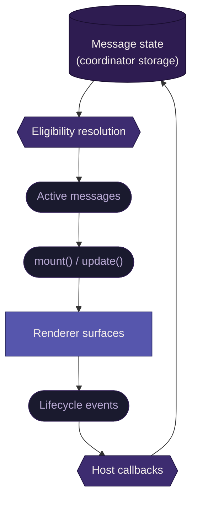

# Messaging <Badge type="warning" text="work in progress" />

This document defines how targeted messages flow through the system: how the coordinator resolves them, how the renderer receives and displays them, and how lifecycle events flow back.

Messaging covers onboarding prompts, feature announcements, and any targeted communication the system surfaces to the user. It is a data concern, not a gating concern. Messages flow through the same channel as content feed or weather data.

## Messaging is not gating

Flags and messaging answer different questions.

**Flags** answer: "is this feature on for this user?" That is a pre-render concern. The renderer receives flag context through `init()` and uses it to make rendering decisions before anything is shown.

**Messaging** answers: "what should we tell this user right now?" That is a runtime data concern. Messages arrive as coordinated data through `mount()` and `update()`, the same delivery path as any other data source.

If a feature needs a pre-render decision (e.g., "don't show onboarding at all"), that decision belongs in the flag system. The messaging system delivers content to users who are already eligible to see it.

## Delivery flow



1. The coordinator reads message state from persistent storage
2. It resolves eligibility and determines which messages are active
3. Active messages are delivered to the renderer through `mount()` (initial set) and `update()` (new messages over time)
4. The renderer displays messages in their target surfaces
5. User interactions produce lifecycle events that flow back through host callbacks
6. The coordinator persists updated state and re-evaluates eligibility

This is a closed loop. The coordinator owns storage and the data pipeline. The renderer owns display and interaction.

## Surfaces

Messages are surface-bound. Each message targets a specific renderer surface. There are no priority conflicts because a message declares where it renders, it does not compete for a shared slot.

| Surface | Purpose | Example |
|---------|---------|---------|
| `feature-highlight` | Tooltip-style callout anchored to a UI element | "Try the new wallpaper feature" |
| `modal` | Centered dialog requiring user attention | First-run onboarding, major announcements |
| `inline-prompt` | Inline content within a section | "Follow more topics to personalize your feed" |
| `toast` | Transient notification at the edge of the viewport | "Content reported successfully" |

The renderer owns the presentation of each surface: positioning, animation, focus management, and dismiss behavior. The message content tells the surface what to show, not how to show it.

## Message shape

```typescript
type MessageSurface = "feature-highlight" | "modal" | "inline-prompt" | "toast"

type Message = {
  /** Stable identifier for this message. */
  id: string

  /** Which renderer surface this message targets. */
  surface: MessageSurface

  /** Surface-specific payload. Shape varies by surface. */
  content: unknown
}
```

`content` is typed as `unknown` at the contract level. Each surface interprets its own content shape. These shapes will be defined when the renderer surfaces are built (Phase 4, task 3M).

## Lifecycle events

When the user interacts with a message, the renderer reports lifecycle events back through host callbacks:

| Event | Meaning | Coordinator action |
|-------|---------|-------------------|
| `impressed` | The message was shown to the user | Increment impression count |
| `dismissed` | The user closed the message without engaging | Record dismissal timestamp |
| `completed` | The user engaged with the message's CTA | Record completion |
| `blocked` | The user permanently blocked the message | Prevent future delivery |

These events are delivered through the [`HostCallbacks`](../spec/lifecycle-contract.md#host-callbacks) interface (`messageImpressed`, `messageDismissed`, `messageCompleted`, `messageBlocked`), the same interface the renderer uses for all host-bound actions. The renderer does not manage message state, evaluate eligibility, or decide which messages to show next. It reports what happened. The coordinator decides what it means.

## State ownership

Messaging state is split across two owners with a clean boundary.

**Coordinator owns message lifecycle storage.** Impression counts, dismissal timestamps, completion records, blocked message IDs. This is operational data in coordinator persistent storage, read at request time and written when lifecycle callbacks arrive. The renderer never reads or writes this storage directly.

**Renderer owns display state.** Whether a tooltip is visible, which animation is playing, whether a modal is transitioning out. This is interaction state, local to the renderer, not persisted.

## Eligibility resolution

The coordinator determines which messages are active. This is coordinator-internal logic. The renderer does not see eligibility rules.

The coordinator evaluates conditions like:

- Has this message been shown fewer than N times?
- Was a prior related message completed?
- Has enough time passed since the user dismissed this?
- Has the user permanently blocked this message?

These are examples, not a fixed rule format. The coordinator is free to implement eligibility however it needs to. What matters is the contract: the renderer receives an array of active messages, nothing more.

## What this replaces

The legacy system has three related subsystems that this design consolidates:

| Legacy | What it did | What replaces it |
|--------|------------|-----------------|
| ASRouter bridge (NewTabMessaging) | Observer-based message delivery from ASRouter to Redux state, with per-tab targeting and synchronous message queries | Messages as coordinated data through `mount()`/`update()`. No observer topics, no per-tab targeting at the messaging level. |
| ExternalComponentsFeed | Browser-chrome component registry injecting components into the newtab React tree | Not carried forward. All components are bundled in the renderer snapshot. |
| Toast notification queue | Redux-driven toast queue with single-item rendering and animation-based dismissal | Toast as a messaging surface. Same capability, delivered through the messaging contract. |

The legacy ASRouter system is Firefox-specific. It uses observer topics, multi-process message channels, and Redux action routing (MESSAGE_SET, MESSAGE_IMPRESSION, MESSAGE_DISMISS, MESSAGE_BLOCK, MESSAGE_CLICK). This system replaces all of that with the standard coordinator-to-renderer data flow and host callback pattern.

::: details Open edges

**Resolved:**

- Messaging is a data concern, not a gating concern. Flows through `mount()`/`update()`.
- Pre-render decisions (should this feature exist at all) are flags, not messages.
- Four surfaces: feature-highlight, modal, inline-prompt, toast.
- Messages are surface-bound. No priority conflicts.
- Lifecycle events flow back through host callbacks.
- Eligibility resolution is coordinator-internal.
- Message state lives in coordinator persistent storage.
- ExternalComponentsFeed is not carried forward.

**To be refined:**

- Per-surface content shapes (Phase 4, task 3M)
- Impression detection strategy (IntersectionObserver + visibility, carried from legacy, needs confirmation)
- Whether messages can target specific UI elements (feature-highlight needs an anchor reference)
- How `update()` signals new messages vs. updated coordinated data. Is messaging a distinct key in `CoordinatedData`, or a separate argument?
- Rate limiting for message delivery (can the coordinator send multiple messages simultaneously?)
:::

## Related documentation

- [Gating](./gating.md) — why messaging is not a gating concern
- [Feature flags](./feature-flags.md) — flags handle pre-render decisions
- [Coordinator](./coordinator.md) — owns eligibility resolution and message state
- [Renderer](./renderer.md) — owns surfaces and display
- [Lifecycle contract](../spec/lifecycle-contract.md) — `mount()` and `update()` delivery
- [Audit: messaging and notifications](../audit/infrastructure/messaging-notifications.md) — legacy system reference
- [Audit: feature highlights](../audit/ui/feature-highlights.md) — legacy highlight implementation
