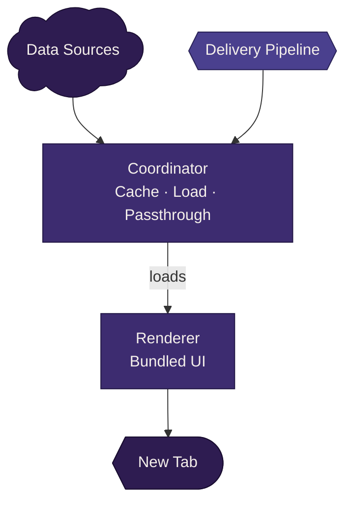

# Architecture Overview

This system is built by separating a traditionally unified surface into clearly defined roles.

Each role has a focused responsibility, and the interactions between them are explicit.

## The high-level flow

At a glance, the system follows a simple flow:

1. Data is sourced from upstream systems
2. The coordinator manages how that data is retrieved, cached, and updated
3. The renderer consumes that data and produces the user experience

Around this flow, build and publish systems act as gatekeepers to ensure everything is valid before it reaches runtime.

## System flow

## The core roles

The system is organized around three conceptual roles.

### API (data modeling and access)

The API in this repository is a development-facing layer.

It exists to:

- model the shape of data used by the system
- proxy or simulate upstream data sources
- support local development and testing

It does not represent a single production service.

In production, data may come from multiple systems. What matters is that the data conforms to the contracts expected by the rest of the system.

### Coordinator (integration and control)

The coordinator is responsible for:

- fetching and caching data
- managing update behavior (such as stale-while-revalidate)
- coordinating which renderer should be used

In this repository, the coordinator is implemented as a reference system.

In production, this behavior will live within browser core, as long as it fulfills the same contracts.

### Renderer (user experience)

The renderer is the part of the system that defines the actual user experience.

It is responsible for:

- rendering UI
- consuming coordinated data
- presenting a complete, self-contained experience

Renderers are built and packaged in this repository, and are intended to be shipped and consumed by the coordinator in production.

## Build and publish as gatekeepers

Before anything reaches runtime, it passes through build and publish systems.

These systems are responsible for:

- assembling artifacts
- validating correctness
- producing deployable outputs

The effect is:

- incomplete or invalid artifacts are rejected early
- runtime systems can assume correctness
- behavior is deterministic and predictable

For more detail:

→ [Build system (how artifacts are produced and validated)](./build-system.md)
→ [Publish pipeline (how artifacts become deployable)](./publish-pipeline.md)

## Local vs production ownership

This repository represents the full system, but not every part is owned here in production.

| Component            | Local (this repo)                                            | Production                                                                     | Notes                                                                           |
| -------------------- | ------------------------------------------------------------ | ------------------------------------------------------------------------------ | ------------------------------------------------------------------------------- |
| **API**              | Development modeling layer — simulates upstream data sources | Does not exist as a single service. Data comes from multiple upstream systems. | Repo models the data shape; production owns the actual sources.                 |
| **Coordinator**      | Reference implementation for development and testing         | Behavior moves to **browser core**                                             | Contracts remain the same. Browser core must fulfill the same responsibilities. |
| **Renderer**         | Built and packaged here                                      | **Shipped from this repo** via publish pipeline to remote settings             | This is the primary production artifact the repo owns.                          |
| **Build system**     | Runs locally (Vite) and in CI                                | Same — runs in GitHub Actions as part of publish pipeline                      | Produces and validates snapshot artifacts.                                      |
| **Publish pipeline** | Does not exist locally — dev reads Vite output directly      | GitHub Actions → validate → PR to remote-settings repo                         | Production-only delivery mechanism.                                             |

What remains consistent across environments:

- the contracts between roles
- the expectations each part must fulfill

This allows different environments to share a common architecture without requiring identical implementations.

## End-to-end lifecycle

Putting it all together:

1. Data is sourced from upstream systems (modeled locally via the API)
2. The coordinator retrieves and caches that data
3. A renderer is selected and loaded
4. The renderer consumes the coordinated data and renders the experience
5. Build and publish systems ensure all artifacts involved are valid before use

For the detailed rules governing these interactions:

- [Snapshot contract](../spec/snapshot-contract.md)
- [Artifact model](../spec/artifact-model.md)
- [Identity model](../spec/identity-model.md)
- [Validation rules](../spec/validation-rules.md)
- [Lifecycle contract](../spec/lifecycle-contract.md)

## Coordinator and Renderer responsibilities

At a high level, the coordinator and renderer have distinct and complementary roles:

| Coordinator                              | Renderer                     |
| ---------------------------------------- | ---------------------------- |
| Controls runtime behavior                | Produces the user experience |
| Retrieves and prepares data              | Consumes prepared data       |
| Selects and loads the renderer           | Is selected and loaded       |
| Triggers data updates and refresh cycles | Owns and manages UI state    |

This relationship is intentionally asymmetric:

- coordinator → controls flow + provides inputs
- renderer → owns state + renders UI

State is intentionally owned by the renderer.

The coordinator provides data and signals when updates occur, but does not manage UI state directly. The coordinator does not own state. It owns when new data enters the system.

Keeping this boundary clear is key to maintaining predictable behavior and avoiding hidden coupling.

## How to read this system

If you are exploring for the first time:

- Start with the [Mental model (how the system thinks)](./mental-model.md)
- Use this document to understand how the pieces fit together
- Dive into specific areas as needed:
  - [Coordinator (integration and caching behavior)](./coordinator.md)
  - [Renderer (how the UI is built and delivered)](./renderer.md)
  - [Data flow (end-to-end lifecycle details)](./data-flow.md)
  - [Gating (how correctness and exposure are enforced)](./gating.md)
