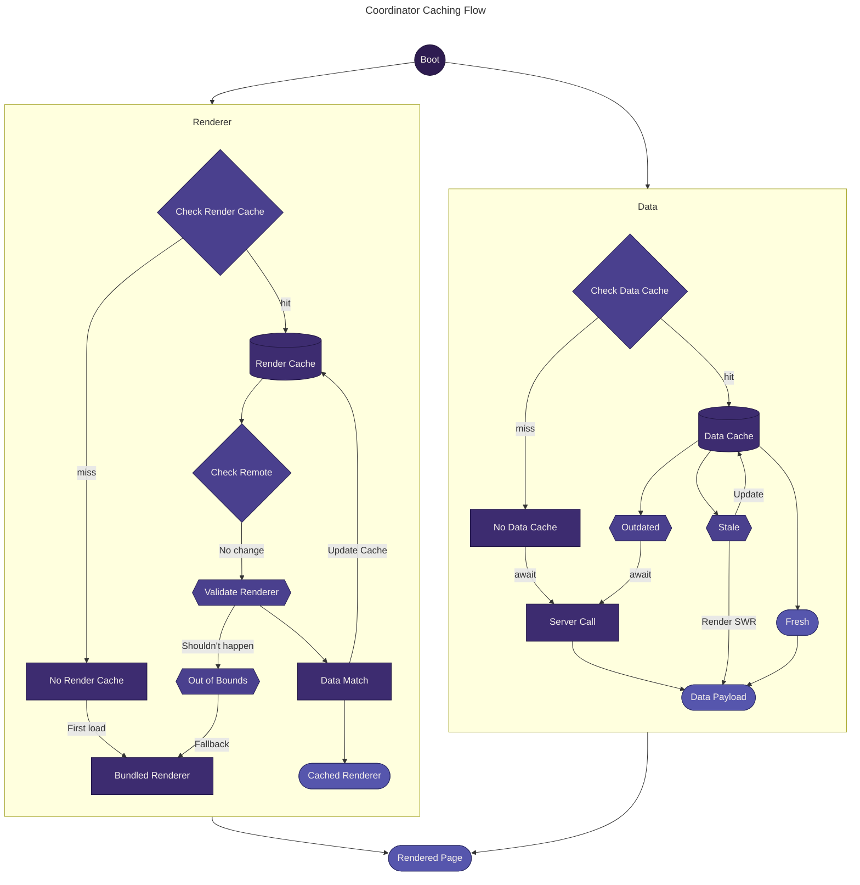

```mermaid
---
title: Coordinator Caching Flow
config:
  flowchart:
    padding: 20
    subGraphTitleMargin:
      top: 20
      bottom: 20
---
flowchart TD
    start@{label: "Boot", shape: circle} --> Renderer
    start --> Data
    Renderer --> result
    Data --> result
    result@{label: "Rendered Page", shape: stadium}

    subgraph Data
        direction TB
        checkData@{label: "Check Data Cache", shape: diamond}
        dataHit@{label: "Data Cache", shape: cylinder}
        dataMiss@{label: "No Data Cache", shape: rect}
        outdated@{label: "Outdated", shape: hexagon}
        stale@{label: "Stale", shape: hexagon}
        fresh@{label: "Fresh", shape: stadium}
        serverCall@{label: "Server Call", shape: rect}
        dataPayload@{label: "Data Payload", shape: stadium}

        checkData -->|hit| dataHit
        checkData -->|miss| dataMiss
        dataMiss -->|await| serverCall
        dataHit --> outdated
        outdated -->|await| serverCall
        dataHit --> stale
        dataHit --> fresh
        serverCall --> dataPayload
        stale -->|Render SWR| dataPayload
        stale -->|Update| dataHit
        fresh --> dataPayload
    end

    subgraph Renderer
        direction TB
        checkRender@{label: "Check Render Cache", shape: diamond}
        renderHit@{label: "Render Cache", shape: cylinder}
        renderMiss@{label: "No Render Cache", shape: rect}
        bundled@{label: "Bundled Renderer", shape: rect}
        checkRemote@{label: "Check Remote", shape: diamond}
        validate@{label: "Validate Renderer", shape: hexagon}
        dataMatch@{label: "Data Match", shape: rect}
        outOfBounds@{label: "Out of Bounds", shape: hexagon}
        cached@{label: "Cached Renderer", shape: stadium}

        checkRender -->|hit| renderHit
        checkRender -->|miss| renderMiss
        renderMiss -->|First load| bundled
        renderHit --> checkRemote
        checkRemote -->|No change| validate
        validate --> dataMatch
        validate -->|Shouldn't happen| outOfBounds
        outOfBounds -->|Fallback| bundled
        dataMatch --> cached
        dataMatch -->|Update Cache| renderHit
    end

    classDef deepest fill:#2e1c51,stroke:#190d30,color:#f5f0eb
    classDef deep fill:#3d2c70,stroke:#211643,color:#f5f0eb
    classDef mid fill:#4a408e,stroke:#282155,color:#f5f0eb
    classDef light fill:#5656ad,stroke:#2e2e68,color:#f5f0eb

    class start deepest
    class checkData,checkRender,checkRemote mid
    class dataHit,dataMiss,renderHit,renderMiss,serverCall,dataMatch,bundled deep
    class validate,outdated,stale,outOfBounds mid
    class fresh,dataPayload,cached,result light
```
