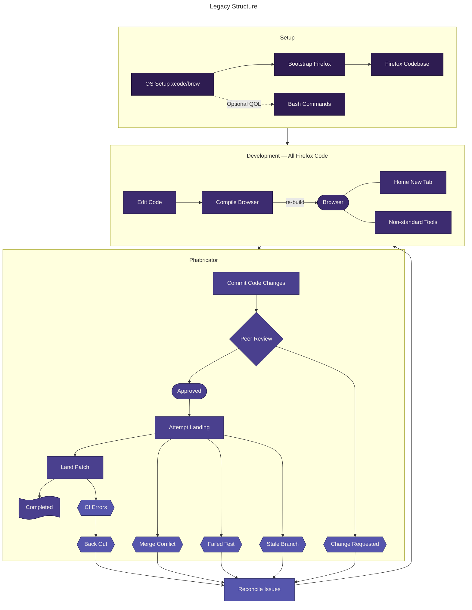
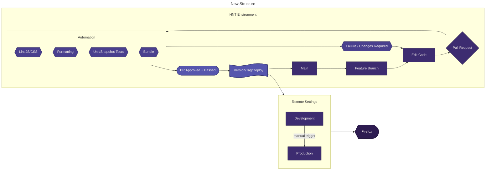

```mermaid
---
title: Legacy Structure
config:
  flowchart:
    padding: 20
    subGraphTitleMargin:
      top: 20
      bottom: 20
---
flowchart TD
    subgraph Setup
        ffos@{label: "OS Setup xcode/brew", shape: rect}
        ffbootstrap@{label: "Bootstrap Firefox", shape: rect}
        ffcode@{label: "Firefox Codebase", shape: rect}
        bashcommands@{label: "Bash Commands", shape: rect}

        ffos --> ffbootstrap --> ffcode
        ffos -.->|Optional QOL| bashcommands
    end

    subgraph Development["Development — All Firefox Code"]
        edit@{label: "Edit Code", shape: rect}
        compile@{label: "Compile Browser", shape: rect}
        browser@{label: "Browser", shape: stadium}
        hnt@{label: "Home New Tab", shape: rect}
        nst@{label: "Non-standard Tools", shape: rect}

        edit --> compile -->|re-build| browser
        browser --- hnt
        browser --- nst
    end

    subgraph Phabricator
        commit@{label: "Commit Code Changes", shape: rect}
        pr@{label: "Peer Review", shape: diamond}
        approved@{label: "Approved", shape: stadium}
        change@{label: "Change Requested", shape: hexagon}
        attemptlanding@{label: "Attempt Landing", shape: rect}
        landpatch@{label: "Land Patch", shape: rect}
        completed@{label: "Completed", shape: flag}
        cierrors@{label: "CI Errors", shape: hexagon}
        backout@{label: "Back Out", shape: hexagon}
        conflict@{label: "Merge Conflict", shape: hexagon}
        stale@{label: "Stale Branch", shape: hexagon}
        failed@{label: "Failed Test", shape: hexagon}

        commit --> pr
        pr --> approved
        pr --> change
        approved --> attemptlanding
        attemptlanding --> landpatch
        attemptlanding --> conflict
        attemptlanding --> failed
        attemptlanding --> stale
        landpatch --> completed
        landpatch --> cierrors
        cierrors --> backout
    end

    Setup --> Development
    Development --> Phabricator

    change --> reconcile
    backout --> reconcile
    stale --> reconcile
    failed --> reconcile
    conflict --> reconcile

    reconcile@{label: "Reconcile Issues", shape: rect} --> Development

    classDef deepest fill:#2e1c51,stroke:#190d30,color:#f5f0eb
    classDef deep fill:#3d2c70,stroke:#211643,color:#f5f0eb
    classDef mid fill:#4a408e,stroke:#282155,color:#f5f0eb
    classDef light fill:#5656ad,stroke:#2e2e68,color:#f5f0eb

    class ffos,ffbootstrap,ffcode,bashcommands deepest
    class edit,compile,browser,hnt,nst deep
    class commit,pr,approved,attemptlanding,landpatch,completed mid
    class change,cierrors,backout,conflict,stale,failed,reconcile light
```

```mermaid
---
title: New Structure
config:
  flowchart:
    padding: 20
    subGraphTitleMargin:
      top: 20
      bottom: 20
---
flowchart LR
    subgraph Development["HNT Environment"]
        main@{label: "Main", shape: rect}
        branch@{label: "Feature Branch", shape: rect}
        edit@{label: "Edit Code", shape: rect}
        pr@{label: "Pull Request", shape: diamond}

        subgraph Automation
            lint@{label: "Lint JS/CSS", shape: hexagon}
            prettier@{label: "Formatting", shape: hexagon}
            test@{label: "Unit/Snapshot Tests", shape: hexagon}
            bundle@{label: "Bundle", shape: hexagon}
        end

        main --> branch --> edit --> pr
        pr --> Automation
        Automation --> passed
        Automation --> failed

        passed@{label: "PR Approved + Passed", shape: stadium} --> version
        failed@{label: "Failure / Changes Required", shape: hexagon} --> edit
        version@{label: "Version/Tag/Deploy", shape: flag} --> main
    end

    subgraph Remote["Remote Settings"]
        development@{label: "Development", shape: rect}
        production@{label: "Production", shape: rect}

        development -->|manual trigger| production
    end

    firefox@{label: "Firefox", shape: curv-trap}

    version --> Remote
    Remote --> firefox

    classDef deepest fill:#2e1c51,stroke:#190d30,color:#f5f0eb
    classDef deep fill:#3d2c70,stroke:#211643,color:#f5f0eb
    classDef mid fill:#4a408e,stroke:#282155,color:#f5f0eb
    classDef light fill:#5656ad,stroke:#2e2e68,color:#f5f0eb

    class main,branch,edit,pr deep
    class lint,prettier,test,bundle mid
    class passed,version light
    class failed mid
    class development,production deep
    class firefox deepest
```
